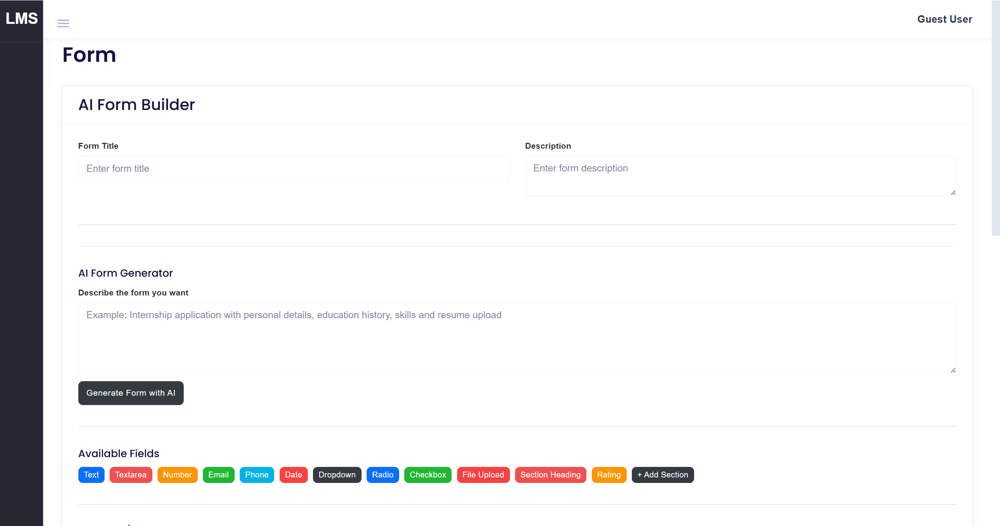

# AI-Powered Form Builder

An AI-powered dynamic form builder built with Laravel, Livewire, MySQL, Blade, Bootstrap and JavaScript.

The application allows administrators to create forms manually, generate forms using AI prompts, organize fields into sections, configure validations, and publish forms through public URLs.

---

## GitHub Repository

https://github.com/KASHYAP45/ai-form-builder

---

# Features

## Part A — Core Form Builder

The form builder supports:

- Create forms manually
- Form title and description
- Add fields using buttons
- Multiple field types
- Edit fields inline
- Delete fields
- Duplicate fields
- Drag-and-drop field ordering
- Sections / Steps
- Assign fields to sections
- Required fields
- Field placeholders
- Help text
- Default values
- Field keys
- Options for dropdown, radio and checkbox fields
- Field validation configuration
- Live field preview
- JSON-based form schema
- Public form URL

### Supported Field Types

The builder supports:

1. Text
2. Textarea
3. Email
4. Phone
5. Number
6. Date
7. Dropdown
8. Radio
9. Checkbox
10. File Upload
11. Section Heading
12. Rating

---

# Validation

Field validation can be configured from the form builder.

Supported validation options include:

- Required
- Minimum value
- Maximum value
- Minimum length
- Maximum length
- Numeric
- Email
- URL
- Regex
- File types
- File size

The schema is used as the source of field configuration so that the form structure can be stored and reconstructed.

---

# Public Forms

Every saved form receives a public URL based on its form identifier/slug.

Example:

```text
/forms/{form_id}

## Screenshots

### 1. AI Form Builder


### 2. AI Form Generator


### 3. AI Generated Form


### 4. Field Configuration


### 5. Validation Rules


### 6. Sections / Steps


### 7. Live Preview


### 8. Public Form
